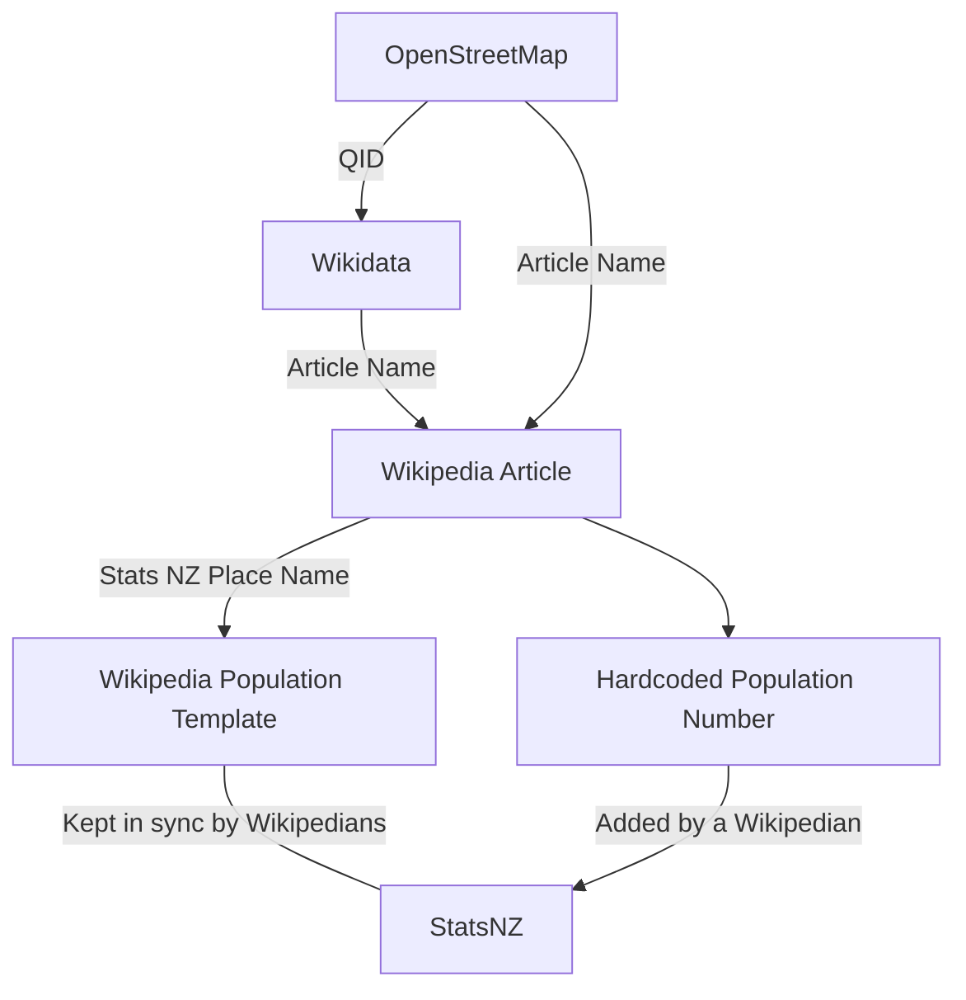

This script extracts the populations for NZ places from the Wikipedia templates, and synchronises them with OpenStreetMap. It does not maintain or even consider the populations in Wikidata, although it would be easy to do this as well.

The script considers all nodes in OSM tagged with [`place=*`](http://wiki.osm.org/Key:place) and [`wikidata=*`](http://wiki.osm.org/Key:wikidata).

It adds or updates the [`population=`](http://wiki.osm.org/Key:population) tag, and adds the [`wikipedia=*`](http://wiki.osm.org/Key:wikipedia) tag if it's missing.

Note: Data from Wikipedia is only used if the source is [Stats NZ / Tatauranga Aotearoa](https://stats.govt.nz), to ensure license compatibility.

## To run the scripts:

- `yarn ts-node scripts/population`

This will generate a TXT report, and a `.osmPatch.geojson` file which you can import using [the fork of RapiD](https://osm-nz.github.io/RapiD).

NOTE: the conflate script caches some API responses, so for a fresh run, delete all the files under `out/pop-*`

# How the population data is found

Additional notes:

- if the wikipedia page has multiple populations for different geographic definitons of the place, then the `urban` population is preffered, falling back to the `metro` population, or the `total` population. `territorial` populations are never used.
